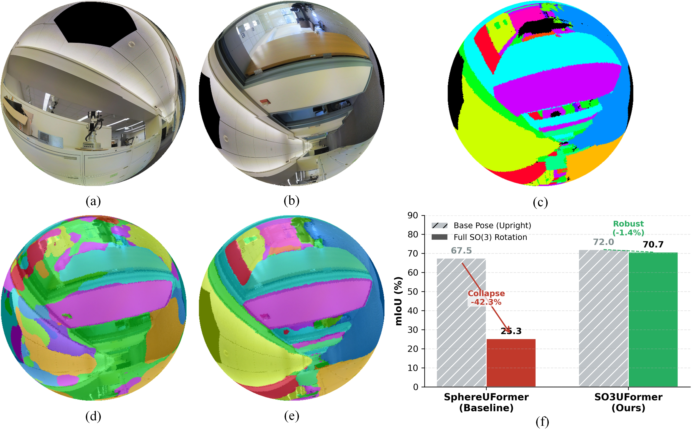

# SO3UFormer: Rotation-Robust Panoramic Segmentation (Pose35)

[](https://arxiv.org/abs/2602.22867)

Official code release for **SO3UFormer** and the **Pose35** protocol:
- Pose35 dataset construction (Stanford2D3D-derived, pose-perturbed)
- Training code for the main model
- **OOD SO(3) stress test** evaluation (full 3D reorientations)
- Pretrained checkpoint

**Paper:** SO3UFormer: Learning Intrinsic Spherical Features for Rotation-Robust Panoramic Segmentation  
**arXiv:** https://arxiv.org/abs/2602.22867

---

## Overview

SO3UFormer studies a practical failure mode in panoramic semantic segmentation: models trained on gravity-aligned panoramas often entangle semantics with a privileged coordinate frame and can collapse under full 3D camera reorientations. We address this by removing absolute latitude bias and using geometry-consistent spherical operators, then evaluate robustness with an OOD **SO(3) stress test**.

---

## Abstract

Panoramic semantic segmentation models are typically trained under a strict gravity-aligned assumption. However, real-world captures often deviate from this canonical orientation due to unconstrained camera motions, such as the rotational jitter of handheld devices or the dynamic attitude shifts of aerial platforms. This discrepancy causes standard spherical Transformers to overfit global latitude cues, leading to performance collapse under 3D reorientations. To address this, we introduce SO3UFormer, a rotation-robust architecture designed to learn intrinsic spherical features that are *less sensitive* to the underlying coordinate frame. Our approach rests on three geometric pillars: (1) an intrinsic feature formulation that decouples the representation from the gravity vector by removing absolute latitude encoding; (2) quadrature-consistent spherical attention that accounts for non-uniform sampling densities; and (3) a gauge-aware relative positional mechanism that encodes local angular geometry using *tangent-plane projected angles* and *discrete gauge pooling*, avoiding reliance on global axes. We further use index-based spherical resampling together with a *logit-level* *SO(3)*-consistency regularizer during training. To rigorously benchmark robustness, we introduce Pose35, a dataset variant of Stanford2D3D perturbed by random rotations within ±35°. Under the extreme test of arbitrary full *SO(3)* rotations, existing SOTAs fail catastrophically: the baseline SphereUFormer drops from 67.53 mIoU to 25.26 mIoU. In contrast, SO3UFormer demonstrates remarkable stability, achieving 72.03 mIoU on Pose35 and retaining 70.67 mIoU under full *SO(3)* rotations.


---

## What’s in this repo

- `src/` — core code (training, model, metrics)
- `src/tools/`
  - `make_pose_perturbed_stanford2d3d.py` — Pose35 dataset generation
  - `rotation_sensitivity.py` — OOD SO(3) stress-test evaluation
- `scripts/` — convenience scripts
  - `make_pose35.sh` — generate Pose35 from Stanford2D3D
  - `train_so3uformer.sh` — train the main model
  - `eval_so3_full3d.sh` — run OOD SO(3) evaluation

---

## Pretrained model

Download the pretrained checkpoint (Google Drive) and place it at:

- `pretrained/model_best_miou.pth`

**Download:** https://drive.google.com/file/d/1wY-MtVnu41SJbzp8o0sCNuEvXuwgKvWJ/view?usp=sharing

Expected usage in evaluation scripts:
- `WEIGHTS=./pretrained/model_best_miou.pth`

---

## Installation

### Requirements
- Python 3.8+
- PyTorch + torchvision (match your CUDA runtime)

Install dependencies:
```bash
pip install -r requirements.txt
````

---

## Dataset: Stanford2D3D

Download **Stanford2D3D** and place it under your data root:

```text
<data_root>/stanford2d3d/
```

---

## Pose35 generation

This project uses a pose-perturbed dataset:

```text
stanford2d3d_pose35_axisU_seed0
```

Generate it with:

```bash
DATA_ROOT=<data_root> \
  bash scripts/make_pose35.sh
```

Output:

```text
<data_root>/stanford2d3d_pose35_axisU_seed0/
```

---

## Training (main model)

The main model configuration corresponds to:

* No absolute latitude positional encoding
* Quadrature-consistent local attention (logit correction with area weights)
* Gauge-pooled Fourier relative positional bias
* Geometry-consistent sampling (area-weighted downsample + geodesic-kernel upsample)
* Training-time logit-space SO(3) consistency regularizer (enabled with weight `λ=0.05`)

Run training (example: 2 GPUs with DDP):

```bash
DATA_ROOT=<data_root> \
OUT_DIR=./outputs/so3uformer \
NPROC_PER_NODE=2 \
MASTER_PORT=29621 \
  bash scripts/train_so3uformer.sh
```

---

## Evaluation: OOD SO(3) stress test (Full3D)

Run the SO(3) robustness evaluation:

```bash
DATA_ROOT=<data_root> \
WEIGHTS=./pretrained/model_best_miou.pth \
OUT_DIR=./outputs/so3_eval \
  bash scripts/eval_so3_full3d.sh
```

The script writes a JSON summary and plots under `OUT_DIR`.

---

## Citation

If you find this project useful, please cite:

```bibtex
@article{zhu2026so3uformer,
  title   = {SO3UFormer: Learning Intrinsic Spherical Features for Rotation-Robust Panoramic Segmentation},
  author  = {Zhu, Qinfeng and Jiang, Yunxi and Fan, Lei},
  journal = {arXiv preprint arXiv:2602.22867},
  year    = {2026},
  url     = {https://arxiv.org/abs/2602.22867}
}
```
---

## Paper Figures

### Figure 1


### Figure 2


### Figure 3

---

## Acknowledgement

We thank the authors of **SphereUFormer** for releasing the baseline architecture implementation, which we used as a reference codebase for the spherical U-shaped backbone and baseline comparisons:
[https://github.com/yanivbenny/sphere_uformer](https://github.com/yanivbenny/sphere_uformer)

---
